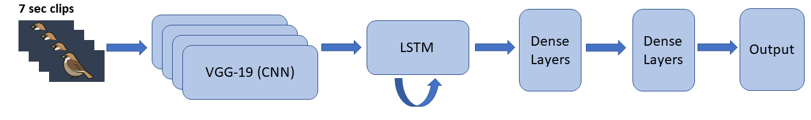

# B) LRCN Framework
Next, I attempted using an LRCN framework, which consists of multiplie CNNs stacked to evaluate each frame, then analyzing it using a recurrent layer. 

  

A summary of model architectures can be found in [Appendix3](https://github.com/alexhang212/SparrowVis_Code/blob/master/Writeup/Jupyters/Supplementary3.ipynb)

## Language
R 3.6.1

## Dependencies
- tensorflow 1.14.0
- keras 1.0.8
- magick 2.6.0
- abind 1.4.5
- tidyverse 1.3.0

## Project Structure
- **TrainCNN.R**: Train simple CNN for meerkat images
- **TrainCNN_VGG19.R**: Train CNN using tranfer learning using VGG19 (Simonyan & Zisserman, 2014) pre-trained weights and architecture
- **TrainRNN_Sex.R**: Stacking multiple meerkat images and analyzing it using Conv-LSTM2D layer to predict sex
- **TrainRNN_Sex3D.R**:Stacking multiple meerkat images and analyzing it using Conv3D layer to predict sex
- **TrainRNN_Behav.R**: Stacking multiple meerkat images and analyzing it using Conv-LSTM2D layer to predict behaviour

## Reference
- **Simonyan, K., Zisserman, A.,** 2014. Very deep convolutional networks for large-scale image recognition. arXiv preprint arXiv:1409.1556.