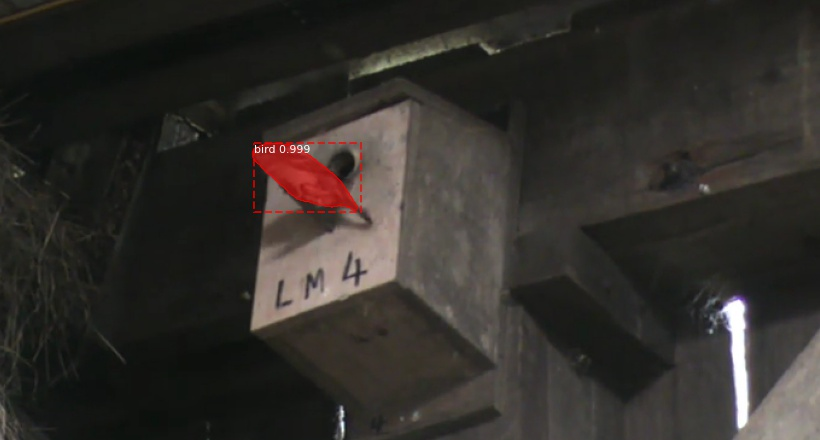
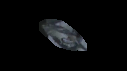

# MaskRCNN
MaskRCNN (He et. al, 2017) is a deep learning model that computes bounding boxes and masks of objects in an image. The git repository for the model can be found [here](https://github.com/matterport/Mask_RCNN)

I obtained the source code from the git repository and trained a new model by annotating 600 images manually (500 training, 100 validation) using the [VGG image annotator](https://www.robots.ox.ac.uk/~vgg/software/via/via-1.0.6.html) (Dutta & Zisserman, 2019). I followed an [online tutorial](https://thebinarynotes.com/how-to-train-mask-r-cnn-on-the-custom-dataset/) to train the model with my own dataset. More information regarding applying the MaskRCNN model can be found in the [zenodo] repository under 'MaskRCNN', including images and annotation json as well as model used for final inference.

## Language
MaskRCNN was ran with python 3.5.6

## Dependencies
- tensorflow 1.4.1
- keras 2.1.0
- scipy 1.4.1
- numpy 1.18.5
- cython 0.29.23
- opencv 3.4.2
- pillow 7.2.0
- h5py 2.8.0
- imgaug 0.2.9


## Project Structure
- **custom directory:** Directory sits within the "samples" directory in the MaskRCNN repository. To train the MaskRCNN using coco as start weight, I ran the following:
```
python custom.py train --dataset=../../dataset --weights=coco
```
- **ExtractMasks.py:**: Used for testing, extract masks of birds and output images with highlighted birds  
  
- **ExtractMasks_pipeline.py**: Used to extract bird masks for actual pipeline, only crops out birds masks  
  

## Reference
- **He, K., Gkioxari, G., Dollár, P., Girshick, R.**, 2017. Mask r-cnn, in: Proceedings of the IEEE International Conference on Computer Vision. pp. 2961–2969. 
- **Dutta, A., Zisserman, A.,** 2019. The VIA Annotation Software for Images, Audio and Video, in: Proceedings of the 27th ACM International Conference on Multimedia, MM ’19. ACM, New York, NY, USA. https://doi.org/10.1145/3343031.3350535