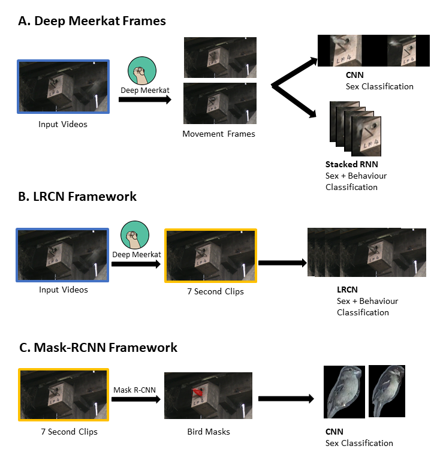

# Sparrow Vis: A framework to analyse and annotate sparrow provisioning videos
This repository contains all code used for the thesis: **Testing the silver spoon effect in a passerine using novel deep learning and computer vision pipeline**. Please read project structure below to access seperate directories for each part of the project.

## Language & Dependencies
Please see README in seperate directories for section specific dependencies.  

## Project Structure
Directories and its contents:  

- **DeepMeerkat**: Code and guidance to run Deep Meerkat  
- **MaskRCNN**: Code and guidance to run MaskRCNN and obtain masks of sparrows  
- **Analysis**: Code to run all silver spoon analysis  
- **Writeup:**: Contain figures and supplementary information for writeup  
- **Pipeline**: Code to process videos from Deep Meerkat Output to events to clips 
- **GenerateTraining**: Generate training data by matching meerkat events with previously annotated data 
- **A) DeepMeerkat Framework**: Training classification models for Deep Meerkat frames  
- **B) LRCN Framework**: Training classification models for 7 second clips  
- **C) MaskRCNN Framework**: Trianing classification models for MaskRCNN masks   

**Deep Learning approaches used**
  

## Author and Affiliations
Alex Chan Hoi Hang  
hhc4317@ic.ac.uk  
MRes Computational Methods in Ecology and Evolution  
Department of Life Sciences  
Imperial College Silwood Park  
UK. SL5 7PY  
